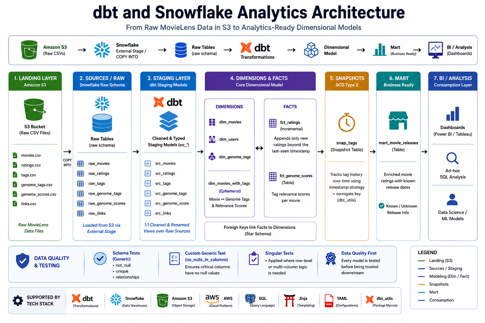
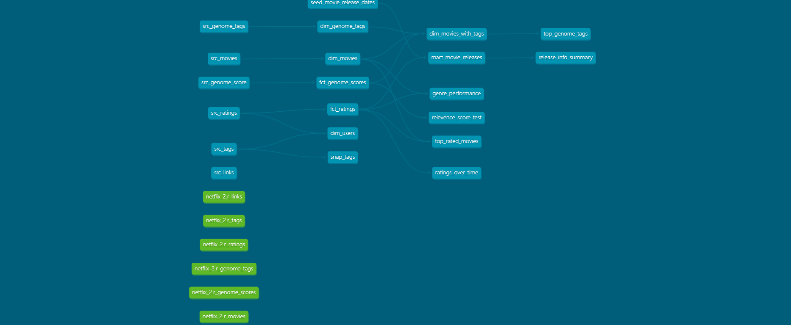
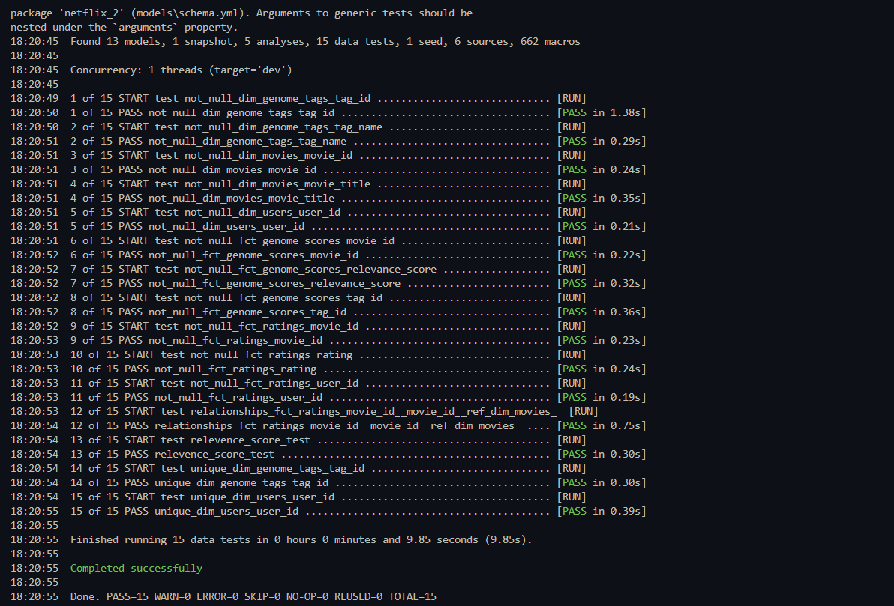

# DBT + Snowflake Analytics Engineering

A dimensional analytics project built with **dbt** on **Snowflake**, transforming raw MovieLens ratings/tagging data — landed in **Amazon S3** and loaded into Snowflake — into a tested, documented star-schema, with staging models, incremental facts, snapshots for slowly changing data, seeds, custom generic tests, and a movie-release mart.

[](https://img.shields.io/badge/dbt-FF694B?style=flat&logo=dbt&logoColor=white) [](https://img.shields.io/badge/Snowflake-29B5E8?style=flat&logo=snowflake&logoColor=white) [](https://img.shields.io/badge/Amazon%20S3-569A31?style=flat&logo=amazons3&logoColor=white) [](https://img.shields.io/badge/AWS-FF9900?style=flat&logo=amazonaws&logoColor=white) [](https://img.shields.io/badge/SQL-336791?style=flat&logo=postgresql&logoColor=white) [](https://img.shields.io/badge/Jinja-B41717?style=flat&logo=jinja&logoColor=white) [](https://img.shields.io/badge/YAML-CB171E?style=flat&logo=yaml&logoColor=white) [](https://img.shields.io/badge/dbt--utils-FF694B?style=flat&logo=dbt&logoColor=white)

---

## 📋 Overview

This project transforms raw MovieLens data — movies, ratings, tags, and genome (tag-relevance) scores — landed in **Amazon S3** and loaded into Snowflake, into a clean, tested, analytics-ready dimensional model. It:

1. **Lands** raw MovieLens CSVs in an **S3 bucket**, then loads them into a `raw` schema in Snowflake (via `COPY INTO` from an external stage), declared as dbt **sources**: `raw_movies`, `raw_ratings`, `raw_tags`, `raw_genome_tags`, `raw_genome_scores`, `raw_links`
2. **Stages** each raw source into a clean, renamed, typed `src_*` model — the only layer allowed to reference raw tables directly
3. Builds **dimension tables** (`dim_movies`, `dim_users`, `dim_genome_tags`) and an **ephemeral** enrichment model (`dim_movies_with_tags`) joining movies to their genome tags and relevance scores
4. Builds **fact tables** — `fct_ratings` (incremental, appends only new ratings past the last-seen timestamp) and `fct_genome_scores`
5. Layers a **snapshot** (`snap_tags`) on top of raw tags using a timestamp strategy to track slowly changing tag history, keyed on a surrogate key from `dbt_utils`
6. Enriches ratings with a **seed** file of known movie release dates in the `mart_movie_releases` mart, flagging rows as `known` / `unknown` release info
7. Enforces data quality with **schema tests** (`not_null`, `unique`, `relationships`) plus a **custom generic macro test** (`no_nulls_in_columns`) applied as a singular test

This mirrors how a real analytics team turns raw, unmodeled event/rating data into governed dimensional models — the same staging → dim/fact → mart layering used for warehouse-driven BI, whether the raw data is ratings, orders, or clickstream events.

---

## 🏗️ Architecture

**Amazon S3 (raw CSVs)** → **Snowflake External Stage / `COPY INTO`** → **Raw Tables** → **Staging (`src_*`)** → **Dimensions & Facts** → **Mart** → **BI / Analysis**

| Layer          | Purpose                                                 | Materialization    | Models                                                              |
| -------------- | -------------------------------------------------------- | ------------------- | -------------------------------------------------------------------- |
| **Landing**    | Raw MovieLens CSVs uploaded to an S3 bucket                | S3 object storage    | `movies.csv`, `ratings.csv`, `tags.csv`, `genome_tags.csv`, `genome_scores.csv`, `links.csv` |
| **Sources**    | Raw tables loaded into the `raw` schema from S3           | Snowflake table      | `raw_movies`, `raw_ratings`, `raw_tags`, `raw_genome_tags`, `raw_genome_scores`, `raw_links` |
| **Staging**    | 1:1 cleaned/renamed view over each raw source             | View                 | `src_movies`, `src_ratings`, `src_tags`, `src_genome_tags`, `src_genome_score`, `src_links` |
| **Dimensions** | Cleaned, deduplicated descriptive entities                | Table (ephemeral for join model) | `dim_movies`, `dim_users`, `dim_genome_tags`, `dim_movies_with_tags` |
| **Facts**      | Event-grained, foreign-keyed measures                    | Table / Incremental  | `fct_ratings` (incremental), `fct_genome_scores`                    |
| **Snapshots**  | Slowly changing tag history                                | Snapshot table        | `snap_tags`                                                          |
| **Mart**       | Business-ready, join-enriched output                       | Table                 | `mart_movie_releases`                                                |

### Architecture Diagram

<!--  -->

### Tech Stack

[](https://img.shields.io/badge/Amazon%20S3-569A31?style=flat&logo=amazons3&logoColor=white) **Raw storage:** Raw MovieLens CSVs landed in an S3 bucket, the entry point before anything reaches Snowflake

[](https://img.shields.io/badge/Snowflake-29B5E8?style=flat&logo=snowflake&logoColor=white) **Warehouse:** Data loaded from S3 into a dedicated `raw` schema via an external stage / `COPY INTO`, separate from dbt-built schemas

[](https://img.shields.io/badge/dbt-FF694B?style=flat&logo=dbt&logoColor=white) **Transformation:** Staging, dimensional modeling, incremental models, snapshots, seeds, macros, and tests, all version-controlled SQL/Jinja

[](https://img.shields.io/badge/dbt--utils-FF694B?style=flat&logo=dbt&logoColor=white) **Packages:** `dbt-labs/dbt_utils` for surrogate key generation in snapshots

[](https://img.shields.io/badge/YAML-CB171E?style=flat&logo=yaml&logoColor=white) **Testing:** Built-in generic tests (`not_null`, `unique`, `relationships`) plus a custom generic macro test (`no_nulls_in_columns`) run as a singular test

**Change tracking:** dbt snapshots (timestamp strategy, hard-delete invalidation) for slowly changing tag data

**Documentation:** `dbt docs generate` for auto-generated data lineage and column-level documentation

---

## 📊 Project Statistics

| Metric | Count |
|---|---|
| Models | 13 |
| Sources | 6 |
| Seeds | 1 |
| Snapshots | 1 |
| Analyses | 5 |
| Data tests | 15 |
| Macros | 662 (incl. dbt_utils package macros) |
| Test result | ✅ 15/15 PASS · 0 WARN · 0 ERROR · 0 SKIP |
| Test runtime | 9.85s |

---

## 📊 dbt Lineage / Docs Output



The graph shows the full flow: raw Snowflake source tables (green) → staging models → dimension/fact models → downstream analyses (`top_rated_movies`, `genre_performance`, `ratings_over_time`, `top_genome_tags`, `release_info_summary`).

<!--  -->

---

## 🔄 Model Flow (dbt DAG)

```
Amazon S3 (raw MovieLens CSVs)
        │
        ▼  external stage + COPY INTO
raw_movies, raw_ratings, raw_tags, raw_genome_tags, raw_genome_scores, raw_links   (sources)
        │
        ▼
src_movies, src_ratings, src_tags, src_genome_tags, src_genome_score, src_links   (staging)
        │
        ├──────────────┬──────────────────┐
        ▼              ▼                  ▼
   dim_movies      dim_users        fct_genome_scores
        │              │                  │
        └──────┬───────┴──────────────────┘
               ▼
     dim_movies_with_tags (ephemeral)
               │
               ▼
          fct_ratings (incremental)
               │
               ▼
     mart_movie_releases  ◄── seed_movie_release_dates (seed)

snap_tags (snapshot, built off src_tags on a schedule)
```

Incremental logic on `fct_ratings` only pulls rows with a `rating_timestamp` newer than the max already loaded, so reruns don't reprocess the full ratings history. The `dim_movies_with_tags` model is ephemeral — it exists only as a CTE inlined into downstream queries, never materialized as its own object in Snowflake.

---

## 🗂️ Model & Table Reference

| Model                    | Layer      | Description                                                                 |
| ------------------------- | ---------- | ----------------------------------------------------------------------------- |
| `src_movies`               | Staging    | Cleaned movie source: `movie_id`, `title`, `genre`                            |
| `src_ratings`               | Staging    | Cleaned ratings source                                                       |
| `src_tags`                 | Staging    | Cleaned user-generated tags source                                            |
| `dim_movies`                | Dimension  | Standardized movie title (`INITCAP`/`TRIM`), genre split into an array        |
| `dim_users`                 | Dimension  | Unique users derived from ratings and tags                                    |
| `dim_genome_tags`           | Dimension  | Genome tag ID → cleaned tag name lookup                                       |
| `dim_movies_with_tags`      | Dimension  | Ephemeral join of movies, genome tags, and relevance scores                   |
| `fct_ratings`               | Fact       | Incremental fact of user ratings, filtered to non-null ratings                |
| `fct_genome_scores`         | Fact       | Relevance score per movie/tag pair                                            |
| `mart_movie_releases`       | Mart       | Ratings enriched with release-date availability (`known` / `unknown`)         |
| `snap_tags`                 | Snapshot   | Timestamp-strategy snapshot of tags for slowly changing history               |
| `seed_movie_release_dates`  | Seed       | Static CSV of movie release dates, loaded via `dbt seed`                      |

---

## ✅ Data Validation & Testing

- **Not-null / uniqueness tests** on primary keys (`movie_id`, `user_id`, `tag_id`) across every dimension
- **Relationship tests** — `fct_ratings.movie_id` and `fct_genome_scores.movie_id`/`tag_id` are validated against their parent dimensions to catch orphaned foreign keys
- **Custom generic macro test** (`no_nulls_in_columns`) — a reusable macro that loops over every column in a given model and asserts none are null, applied as a singular test on `fct_genome_scores`
- **Incremental safety** — `fct_ratings` is configured with `on_schema_change='fail'`, so an unexpected upstream schema change fails loudly instead of silently corrupting the incremental table
- **Snapshot integrity** — `snap_tags` uses `invalidate_hard_deletes=True` so deleted source rows are correctly marked as expired rather than left stale

### Test Run Output


All 15 data tests pass: not-null checks across every dimension's primary key, uniqueness checks on tag and user IDs, a relationship test tying `fct_ratings` back to `dim_movies`, and the custom `relevence_score_test` singular test.

---

## 📁 Repository Structure

```
Movie-lens/
├── dbt_project.yml              # Project config, model materialization defaults
├── packages.yml                 # dbt_utils dependency
├── package-lock.yml
│
├── models/
│   ├── sources.yml               # Raw table declarations (raw schema)
│   ├── schema.yml                # Model descriptions + tests
│   ├── staging/
│   │   ├── src_movies.sql
│   │   ├── src_ratings.sql
│   │   ├── src_tags.sql
│   │   ├── src_genome_tags.sql
│   │   ├── src_genome_score.sql
│   │   └── src_links.sql
│   ├── dim/
│   │   ├── dim_movies.sql
│   │   ├── dim_users.sql
│   │   ├── dim_genome_tags.sql
│   │   └── dim_movies_with_tags.sql   # ephemeral
│   ├── facts/
│   │   ├── fct_ratings.sql             # incremental
│   │   └── fct_genome_scores.sql
│   └── mart/
│       └── mart_movie_releases.sql
│
├── snapshots/
│   └── snap_tagls.sql            # snap_tags — timestamp-strategy SCD
│
├── seeds/
│   └── seed_movie_release_dates.csv
│
├── macros/
│   └── no_nulls_in_columns.sql   # custom generic test macro
│
├── tests/
│   └── relevence_score_test.sql  # singular test using the macro
│
└── analyses/
    └── movie_analysis.sql
```

---

## ⚙️ Configuration

The project connects to Snowflake via a dbt `profiles.yml` (kept outside version control). Set up your profile with:

```yaml
netflix_2:
  target: dev
  outputs:
    dev:
      type: snowflake
      account: <your_account_locator>
      user: <your_username>
      password: <your_password>
      role: <your_role>
      database: MOVIELENS
      warehouse: <your_warehouse>
      schema: <your_dev_schema>
      threads: 4
```

Raw source data is expected under `MOVIELENS.RAW` (`raw_movies`, `raw_ratings`, `raw_tags`, `raw_genome_tags`, `raw_genome_scores`, `raw_links`) before running dbt. These are loaded from the S3 bucket via a Snowflake **external stage** and `COPY INTO`, e.g.:

```sql
CREATE OR REPLACE STAGE movielens_stage
  URL = 's3://<your-bucket-name>/movielens/'
  CREDENTIALS = (AWS_KEY_ID = '<key>' AWS_SECRET_KEY = '<secret>');

COPY INTO MOVIELENS.RAW.RAW_MOVIES
  FROM @movielens_stage/movies.csv
  FILE_FORMAT = (TYPE = CSV SKIP_HEADER = 1);
```

---

## 🚀 Getting Started

```bash
# Clone the repo
git clone https://github.com/Ayan-Ahmad-0/DBT-SNOWFLAKE-ANALYTICS.git
cd DBT-SNOWFLAKE-ANALYTICS/netflix_2

# Upload raw MovieLens CSVs to your S3 bucket, then load them into
# Snowflake's raw schema via an external stage + COPY INTO (see Configuration above)

# Install dbt package dependencies (dbt_utils)
dbt deps

# Load the seed file (movie release dates)
dbt seed

# Build all models
dbt run

# Run all tests (schema + custom generic + singular)
dbt test

# Build slowly changing snapshot of tags
dbt snapshot

# Generate and view interactive docs / lineage graph
dbt docs generate
dbt docs serve
```

---


<!-- Fill in real debugging/design decisions, e.g.: -->
<!-- - Handled X issue with incremental logic on fct_ratings -->
<!-- - Resolved Y schema drift / snapshot config issue -->

---

## 🛠️ Future Improvements

- Add a CI workflow (GitHub Actions) to run `dbt build` and `dbt test` on every PR
- Expand test coverage with `dbt-expectations` for distribution-based checks
- Add exposures to document downstream BI dashboards consuming these marts
- Deploy scheduled runs via dbt Cloud or an orchestrator (Airflow/Dagster) instead of manual `dbt run`
